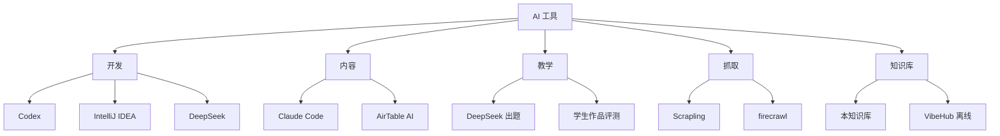

# AI 工具入口

> 我日常用的 AI 工具和工作流。dossier 是入口门槛。

## 工具全景

## 我日常用的

| 工具 | 用途 | 档案 |
|---|---|---|
| **Codex** | 默认开发 + 知识库共建 + 抓取 / 检索 / 自动化 | [[50_AI/]] |
| **DeepSeek** | Python 冒险岛自动出题 | [[60_Assets/dossiers/python-adventure]] |
| **Scrapling** | 本地抓取(代替 firecrawl) | [[20_Projects/Scrapling]] |
| **firecrawl** | 全站抓取(备用) | [[20_Projects/firecrawl]] |
| **Claude Code** | 内容创作辅助 | - |
| **IntelliJ IDEA 2026.1** | 工程打开、编译、运行、测试、调试 | [[50_AI/intellij-idea]] |

## Codex 会话数据

- 会话总数:**92 个**
- 落档位置:`[[60_Assets/codex-session-digest.json]]`
- 摘要:`[[60_Assets/codex-session-summary.md]]`

## 评测口径

每个新 AI 工具进入我的工作流前,必须先写 dossier:
- 用途 / 谁用 / 替代什么
- 风险 / 替代方案
- 真实项目验证

## 找具体 AI 卡

- 工具档案:`[[50_AI/index]]`
- VibeHub 资料:`[[70_Sources/vibe-hub/]]`(484 页离线)

## 入口也看

- [[00_Home/MOCs/projects]] · 项目入口
- [[00_Home/MOCs/teaching]] · 教学入口
- [[00_Home/MOCs/content]] · 内容入口