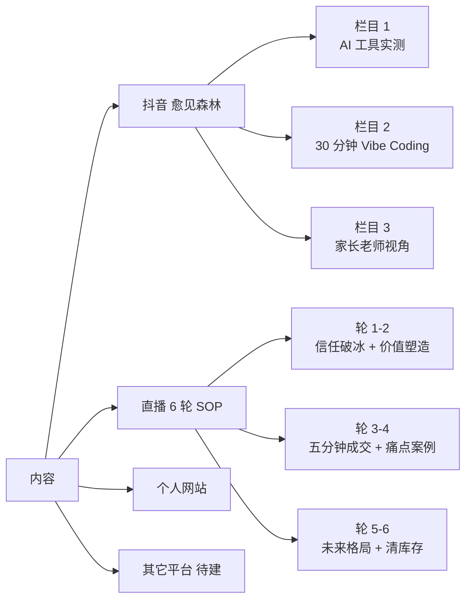

# 内容体系入口

> 我对外发声的入口:抖音「愈见森林」+ 直播 + 个人网站。

## 内容全景

## 抖音「愈见森林」现状

| 维度 | 数据 |
|---|---|
| 抖音号 | 79212093120 |
| 粉丝 | 151(目标 10000) |
| 获赞 | 2246 |
| 作品 | 66 |
| 历史最高单条 | 4.7 万播放 |
| 新粉率 | 约 0.2%(目标 0.8%) |

## 三大固定栏目

| 栏目 | 长度 | 目标 | 标题方向 |
|---|---|---|---|
| **AI 工具实测** | 20-35 秒 | 冲点击 + 冲新粉 | 学生现在就能用的 AI 神器 |
| **30 分钟 Vibe Coding** | 30-60 秒 | 冲收藏 | 30 分钟做完这个网站 |
| **家长老师视角** | 35-70 秒 | 冲评论 + 冲人设 | 真正会被 AI 拉开差距的不是差生 |

## 直播 6 轮(单场 2 小时)

| 轮 | 时间 | 关键动作 |
|---|---|---|
| 1 | 00:00-00:15 | 信任破冰 |
| 2 | 00:15-00:30 | 价值塑造 |
| 3 | 00:30-00:45 | 五分钟成交 |
| 4 | 00:45-01:10 | 痛点 + 案例 |
| 5 | 01:10-01:30 | 未来格局 |
| 6 | 01:30-02:00 | 终极冲刺 |

## 找具体内容卡

- 抖音档案:`[[60_Assets/dossiers/douyin]]`
- 直播档案:`[[60_Assets/dossiers/live-streaming]]`
- 内容卡:`[[40_Content/index]]`

## 入口也看

- [[00_Home/MOCs/projects]] · 项目入口
- [[00_Home/MOCs/ai_tools]] · AI 工具入口