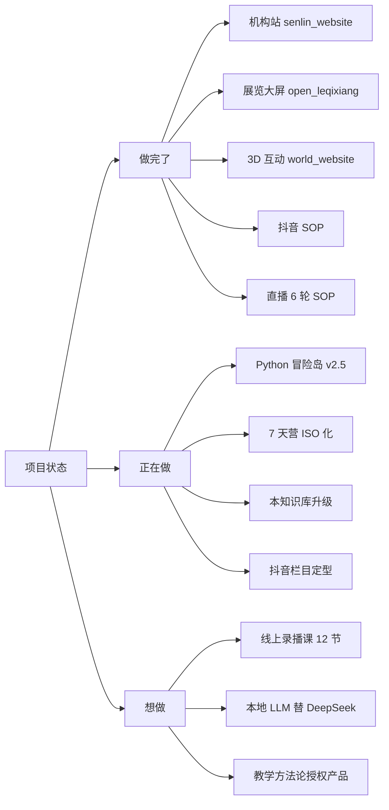

# 项目地图入口

> 找项目的两个路径:**全景图**(下面)或者**真实档案**([[60_Assets/dossiers/]])。

## 按"做完了 / 正在做 / 想做"分

## 按"对谁"分

| 受众 | 项目 |
|---|---|
| **家长** | senlin_website / 个人站 / 抖音 |
| **学员(小学生)** | Python 冒险岛 / 7 天营 / 寒创赛营 |
| **学员(初中)** | 宇宙探索 / 坦克大战 / 个人作品集 |
| **同行老师** | 本知识库 / 教案包 / VibeHub 资料 |
| **机构来访者** | 乐其翔展览大屏 |

## 找具体项目

- 全景:`[[20_Projects/index]]`
- 真实档案:`[[60_Assets/dossiers/]]`

## 入口也看

- [[00_Home/MOCs/teaching]] · 教学体系入口
- [[00_Home/MOCs/content]] · 内容体系入口
- [[00_Home/MOCs/ai_tools]] · AI 工具入口