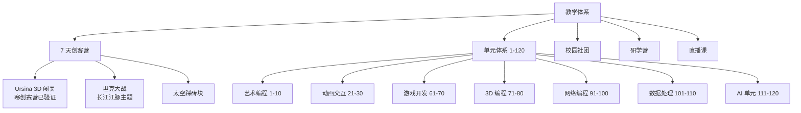

# 教学体系入口

> 给同行老师、家长、徒弟看:我在教什么、怎么教、教到什么程度。

## 教学全景

## 课程定位

| 学段 | 课程类型 | 技术栈 |
|---|---|---|
| 小学低年级 (1-3 年级) | 艺术编程 / 动画交互 | Scratch / 图形化 |
| 小学高年级 (4-6 年级) | 游戏开发入门 / 3D 编程 | Python / Arcade / Ursina |
| 初中 (7-9 年级) | AI 单元 / 网络编程 / 数据处理 | Python + AI API |

## 7 天创客营(旗舰课程)

**主题**:3D 动作闯关(类似《黑神话悟空》简化版)
**技术栈**:Python 3.8+ / Ursina 5.x-8.x / Kenney Graveyard Kit
**时长**:每天 2 小时 × 7 天
**适合**:有 Python 基础的初中生

| 天 | 主题 | 阶段成果 |
|---|---|---|
| Day1 | 3D 世界初探 | 看到 3D 墓地场景 |
| Day2 | 玩家角色 | 能控制角色移动 |
| Day3 | 敌人来袭 | 敌人会追踪玩家 |
| Day4 | 战斗系统 | 能攻击 / 受伤 |
| Day5 | 道具与波次 | 完整游戏循环 |
| Day6 | Boss 战 | 可挑战 Boss |
| Day7 | 个性化与展示 | 最终作品评选 |

## 教学评估标准

| 维度 | 权重 |
|---|---|
| 完成度 | 40% |
| 创意性 | 30% |
| 代码质量 | 15% |
| 展示表现 | 15% |

## 找具体课程卡

- 教学档案:[[60_Assets/dossiers/teaching]]
- 教学卡:[[30_Teaching/index]]

## 入口也看

- [[00_Home/MOCs/projects]] · 项目入口
- [[00_Home/MOCs/content]] · 内容入口