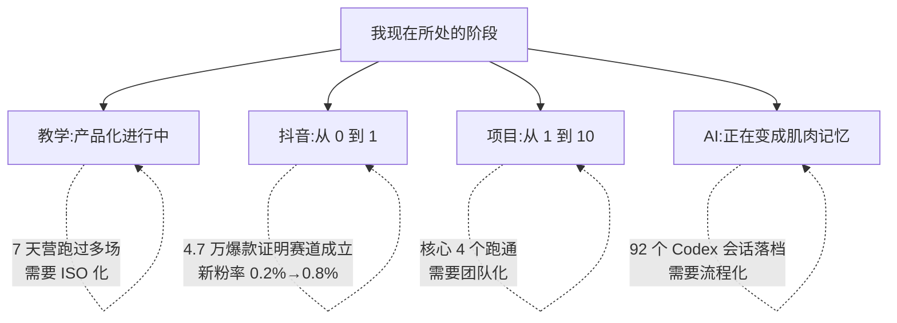

# 我在哪

> 用 30 秒能看完我当前做哪些事、做到什么程度。下次更新:2026-08-27。

## 总览



## 教学

| 维度 | 当前状态 |
|---|---|
| 学段 | 小学高年级 + 初中(主要) / 高中偶尔带竞赛 |
| 课程体系 | 18 个单元分类(1-120)+ 7 天创客营 |
| 7 天营跑过 | 寒创赛营(2026 寒假)+ 多场周末营 |
| 学员作品 | 100+ 件(坦克大战 / 3D 闯关 / 太空踩砖块 / 个人站 / 抖音脚本) |
| 团队 | 4 个徒弟各自搭自己的知识库 |

**真实卡点**:教学体系有但**没有 ISO 化**,教案 + PPT + 源码 + 复盘没成套。

## 项目

| 项目 | 状态 | 受众 |
|---|---|---|
| **乐启享机构站**(senlin_website / codebn.cn) | 跑通,迭代中 | 家长 / 学员 |
| **Python 冒险岛**(game.codebn.cn) | v2.4.7 上线,正在做 v2.5 | 小学-初中 + 家长 |
| **乐其翔展览系统**(open_leqixiang) | 大屏站点,正在做性能优化 | 机构来访者 |
| **宜昌宇宙探索**(world_website) | 3D 互动原型 | 学员作品展示 |

完整 30+ 个项目见 [[20_Projects/index]]。

## 内容

| 维度 | 数字 |
|---|---|
| 抖音「愈见森林」粉丝 | **151** |
| 抖音获赞 | 2246 |
| 抖音作品 | 66 |
| 历史最高单条播放 | **4.7 万** |
| 单条新粉率 | 约 0.2% → 目标 0.8% |
| 抖音号 | 79212093120 |

**真实卡点**:栏目打散了,3 个固定栏目需要砍掉弱的 + 加强强的。

## AI 实践

| 维度 | 数据 |
|---|---|
| Codex 会话 | 92 个已落档到 [[60_Assets/codex-session-digest.json]] |
| DeepSeek | 已接入 Python 冒险岛出题 |
| Scrapling | 本地抓取主力(代替 firecrawl) |
| 本知识库 | 7 个核心 dossier + 50+ 张手写卡 |

## 当前季度在做的事

1. 把 7 天创客营整套(教案 / PPT / 源码 / 复盘)ISO 化
2. 抖音跑栏目 C(35-70 秒,家长老师向),看新粉率能否突破 0.5%
3. 把 Python 冒险岛 v2.5 计划跑通
4. 本知识库升级到生产级别(就是这次)

## 时间分配(粗估)

```
教学 + 直播     50%
项目 + 代码      25%
内容 + 抖音     15%
AI + 知识库     10%
```

## 风险与卡点

- **时间紧**:教学 + 直播切片化,留给"沉淀"的时间不够 → 用 Codex 帮我省
- **代码散**:C:\kaifa + C:\kaifa_senlin + C:\kaifa_boot + C:\kaifa_teacher 四个目录 → 本知识库做索引
- **AI 更替快**:每周都有新工具 → 评测口径统一在 dossier
- **抖音人设**:还没固化成一句话 → 主页要重做

## 下一步怎么走

- [[10_Profile/我要去哪]] · 这一年的目标
- [[00_Home/本周最重要的事]] · 接下来 7 天