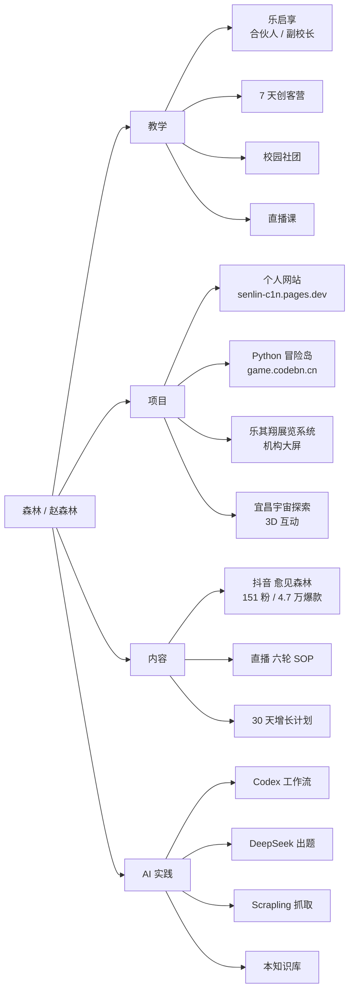

# 我是谁

> 湖北宜昌猇亭人,在乐启享做副校长,带学生做项目式编程,同时跑自己的内容、个人网站和 AI 工作流。

## 我的来历

我从小在宜昌猇亭长大,后来开始教孩子编程。一开始只是把课堂变成看得见的作品 —— 学生能写一个游戏、能搭一个网站、能上台讲自己的项目。六年下来,慢慢长成了**乐启享的合伙人 / 副校长**。

同时我在抖音上开了 **「愈见森林」** 这个账号,讲 AI 工具怎么用、Vibe Coding 怎么做、家长老师怎么用 AI 提效。这个号和我上课是同一个我 —— 都是那个动手派的森林。

我也搭了自己的个人网站 [senlin-c1n.pages.dev](https://senlin-c1n.pages.dev/),把作品、抖音、教学、个人 AI 工作流都放在一个入口。

## 我现在的样子

## 我的几件事

**教学**:在乐启享带项目式编程课,小班 + 创客营,一周多次课。也给校园社团做选修,带研学营。
**项目**:写了不少教学产品(后面 [[20_Projects/index|项目地图]] 列了 30+ 个)。最被验证的是 [Python 冒险岛](file:///C:/my_know/20_Projects/python-adventure.md)和乐其翔展览系统。
**内容**:抖音「愈见森林」跑过一条 4.7 万播放的爆款,但整体还在涨粉早期(151 粉 → 10000 粉)。
**AI**:用 Codex 做我的开发助手、内容助手、知识库共建助手。DeepSeek 接入到 Python 冒险岛里给学生自动出题。

## 我重视的事

- **作品第一** —— 学生 / 家长 / 抖音观众,看到的都该是已经跑起来的东西,不是 PPT。
- **能复制** —— 7 天营、6 轮直播、30 天抖音增长,都是别人可以复用的工作流,不是只有我能做。
- **真实优先** —— 给学生的代码、给抖音观众的教程、给徒弟的方案,都跑过再说。

## 我不擅长的事

- 大型多人游戏服务端 / iOS Android 原生 / 安全逆向 / 大规模投流 —— 这些我没真实项目,不接。
- 抽象的"AI 时代怎么看"类输出 —— 抖音调研显示这种内容新粉率最低,我砍掉了。

## 想了解我具体怎么做?

- [[10_Profile/我在哪]] · 我现在做哪些事、做到哪了
- [[10_Profile/我要去哪]] · 这一年的目标和路线图
- [[10_Profile/能力地图]] · 我能稳定交付什么、正在补什么
- [[20_Projects/index]] · 我做过的项目全景
- [[60_Assets/dossiers/]] · 7 个核心项目的真实档案