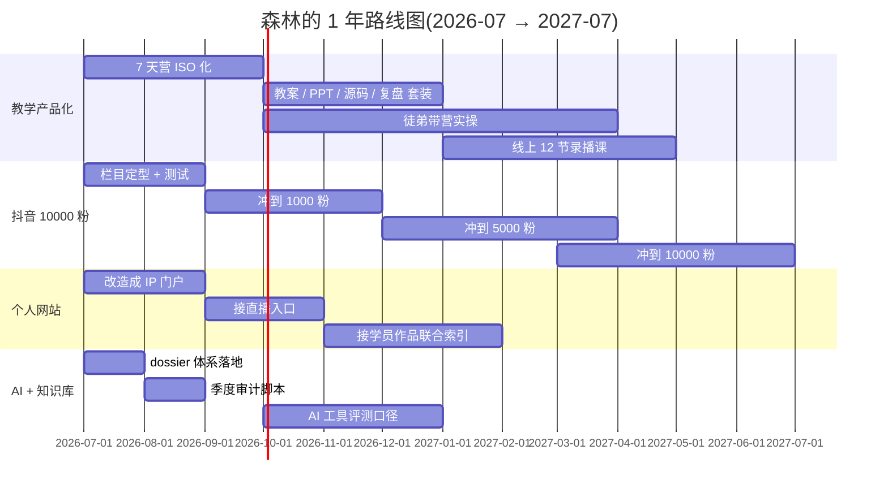

# 我要去哪

> 一年的核心目标:**教学产品化 + 抖音到 10000 粉**。下面这条路线是倒推出来的。

## 一年后(2027-07)我想看到的自己

- 教学产品跑得动:7 天营能由徒弟带,我自己只做审核和改版
- 抖音稳定输出:周更 3-4 条,新粉率长期 0.5%+
- 个人网站有访客:senlin-c1n.pages.dev 成为家长 / 学员 / 同行 的入口
- AI 工具评测口径:**dossier 体系**成为我的标准,任何新工具先写档案再决定是否纳入

## 怎么到那里

## 90 天目标(2026-07 → 2026-10)

- [ ] 7 天营 ISO 化第一版(寒创赛营的标准版)
- [ ] 抖音「愈见森林」栏目定型,**新粉率冲到 0.5%**
- [ ] senlin-c1n.pages.dev 改造成个人 IP 门户
- [ ] 本知识库 dossier 体系跑通(就是现在)
- [ ] Python 冒险岛 v2.5 出包(本地 LLM 替 DeepSeek 省钱)

## 1 年目标(2026-07 → 2027-07)

- [ ] 7 天营至少跑 5 场,其中 3 场由徒弟带
- [ ] 抖音到 **10000 粉**,周更 3-4 条,新粉率长期 0.5%+
- [ ] 个人网站有 1000+ 月活
- [ ] 录播课 12 节上线,带 30+ 学员完整学完 Python 冒险岛
- [ ] 教学方法论沉淀成可授权产品

## 3 年目标(2026-07 → 2029-07)

- [ ] 乐启享团队(我 + 4 徒弟 + 1 个设计师)能独立开营
- [ ] 抖音到 10 万粉,方法论已经能写 1 本书 / 1 门课
- [ ] 个人网站成为家长 / 学员 / 同行 / AI 学习者的统一入口
- [ ] 至少有 3 个开源项目(展览系统 / Python 冒险岛 / 抖音脚本工具)被外部使用

## 不做的事(边界)

- **不接不匹配我受众的外包** —— NOIP / 机器人比赛 / 猇亭家长 之外不接
- **不做只追热点的抖音** —— 拒绝"颠覆""天塌了"式表达
- **不为 1 个作品耗 2 个月** —— 30 天无新粉就调栏目
- **不为"好看"重做主站** —— senlin_website 是承接站不是门面站
- **不再在没经过真实项目验证的 AI 工具上花 > 30 分钟**

## 关键里程碑

- [x] 2026-07-27:本知识库 dossier 体系落地(7 个核心档案)
- [x] 2026-07-27:Obsidian 配置指向 `C:\my_know`,生产可用
- [ ] 2026-08-30:抖音到达 1000 粉,3 个栏目都跑通
- [ ] 2026-09-30:7 天营 ISO 化第一版上线,带 1 场
- [ ] 2026-10-31:Python 冒险岛 v2.5 出包
- [ ] 2026-12-31:抖音到达 5000 粉
- [ ] 2027-03-31:抖音到达 **10000 粉**
- [ ] 2027-07-31:录播课 12 节上线,个人站月活 1000+

## 季度复盘节奏

- **每周日 22:00**:[[00_Home/本周最重要的事]] 复盘
- **每月 1 号**:[[00_Home/MOCs/weekly_review]] 整月复盘
- **每季度**:重读 [[10_Profile/我是谁]] + [[10_Profile/我要去哪]]
- **每年**:重写 [[10_Profile/我要去哪]]

## 怎么知道我没偏

如果接下来 90 天:
- 抖音没到 500 粉 → 栏目 + 人设重新做
- 7 天营 ISO 化没动 → 教学产品化优先级上调
- 知识库 90 天没更新 → 暂停其它工作先沉淀

## 想看具体执行?

- [[00_Home/本周最重要的事]] · 这一周
- [[10_Profile/我在哪]] · 现在进度
- [[00_Home/最终验收]] · 季度收尾