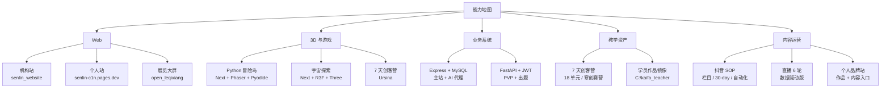

# 能力地图

> 用证据回答:**我能稳定交付什么、正在补什么、暂时不接什么**。每一条都能跳到 [[60_Assets/dossiers/]] 真实档案。

## 我能稳定交付什么

## 一句话核心能力

> **把抽象知识变成 1-30 天内可发布、可展示、可教学的作品。**

| 维度 | 我能稳定交付的 | 证据 |
|---|---|---|
| **Web** | 从需求到 Vite / Next.js 站点到 Cloudflare Pages / Vercel / 宝塔多端部署 | [[60_Assets/dossiers/open_leqixiang]] / [[60_Assets/dossiers/python-adventure]] / [[60_Assets/dossiers/senlin_website]] / [[60_Assets/dossiers/world_website]] |
| **3D 与游戏** | Three.js / R3F / Phaser / Pyodide / Ursina 教学项目 | python-adventure (Phaser + Pyodide) / world-website (R3F) / 25年寒假创赛营 (Ursina) |
| **业务系统** | Express + MySQL + JWT + bcrypt + AI 代理 / FastAPI + SQLAlchemy + WebSocket | senlin_website server.js 32KB / python-adventure backend 32 个路由 |
| **教学资产** | 7 天创客营 + 18 单元分类 + starter/complete/final 三套代码 | C:\教案\25年寒假创赛营\ + C:\教案 18 个分类 |
| **内容** | 短视频选题 SOP + 直播六轮 SOP + 30 天增长计划 + 自动化 runbook | C:\kaifa_senlin\douyin\accounts\yujian-senlin\ + C:\直播数据复盘笔记\ |

## 我正在补什么

| 补的方向 | 为什么 | 怎么做 |
|---|---|---|
| **大模型应用工程** | DeepSeek 出题已经用,但 RAG / Agent / 评测没系统化 | python-adventure v2.5 跑通本地 LLM 替 DeepSeek |
| **教学 ISO 化** | 7 天营跑过多场,但教案 + PPT + 源码 + 复盘没成套 | [[00_Home/本周最重要的事]] 持续推进 |
| **多人作品发布管线** | 4 个徒弟 + 学员作品需要一条流水线 | 用 GitHub Pages + 抖音栏目走通 |
| **跨平台分发** | 抖音之外的视频号 / 公众号 / 小红书还没碰 | 抖音先到 1000 粉再说 |
| **知识管理可教学化** | 本知识库现在是给我自己用,徒弟版本要更简化 | dossier 体系稳定后抽《知识库搭建指南》 |

## 我暂时不接什么

| 不接的方向 | 原因 |
|---|---|
| 大型多人游戏服务端 | 没真实项目验证 |
| iOS / Android 原生开发 | 没真实项目验证 |
| 安全逆向 / 渗透测试 | senlin_website 安全只是"够用",不深 |
| 大规模商业投流 / 增长模型 | 直播 SOP 是 0-1,不是 1-10 |
| 没经过真实项目验证的 AI 工具 | dossier 是门槛 |

## 我的核心优势

> 不是某个单点框架强,是**能把抽象 → 1-30 天作品**这条转换链跑通。

- **7 天创客营** · Python 基础 → 完整 3D 闯关游戏
- **30 天抖音计划** · 151 粉 → 1000 粉 → 10000 粉
- **6 轮直播 SOP** · 一次直播可量化成交
- **18 单元教学体系** · 1-120 号进阶

## 工具链(我日常用的)

- **Codex** · 默认开发 + 知识库共建
- **IntelliJ IDEA 2026.1** · 工程打开、编译、运行、测试、调试
- **Git / GitHub** · 版本管理与远端同步
- **Cloudflare Pages / Vercel** · Web 发布
- **PowerShell** · 本地命令与脚本
- **Scrapling / firecrawl** · 本地抓取
- **Obsidian** · 知识库前端

## 怎么看我的能力等级?

每个月我会用 4 档自评:

| 等级 | 含义 |
|---|---|
| **了解** | 知道是什么,能复述给别人 |
| **能做** | 能独立做出 demo,但要查文档 |
| **能教** | 能给别人讲明白 + 帮他 debug |
| **能带人** | 能给徒弟立 SOP,让他独立做 |

## 想知道每个能力的真实档案?

- [[60_Assets/dossiers/open_leqixiang]] · Vite + React 19 + TS 5.9 展览大屏
- [[60_Assets/dossiers/python-adventure]] · Next 16 + Phaser + Pyodide + FastAPI 全栈游戏
- [[60_Assets/dossiers/senlin_website]] · Express + MySQL + AI 代理机构站
- [[60_Assets/dossiers/world_website]] · Next 14 + R3F 8 + Three 0.169 3D 互动
- [[60_Assets/dossiers/douyin]] · 愈见森林 151 → 10000 粉路径
- [[60_Assets/dossiers/live-streaming]] · 直播 6 轮数据驱动 SOP
- [[60_Assets/dossiers/teaching]] · 18 单元 + 7 天创客营