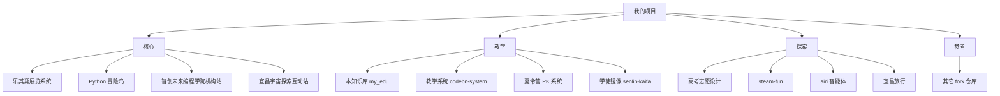

# 我的项目地图

> 这里有 30+ 个项目,按"核心 / 教学 / 探索 / 参考"四类分组。每个项目卡背后都跳到真实档案。

## 项目全景

## 核心项目(已经有完整档案)

| 项目 | 类型 | 受众 | 档案 |
|---|---|---|---|
| **乐其翔展览系统** | Web + 大屏 | 机构来访者 | [[60_Assets/dossiers/open_leqixiang]] |
| **Python 冒险岛** | 游戏 + 教学 | 小学-初中 | [[60_Assets/dossiers/python-adventure]] |
| **智创未来编程学院机构站** | Web + 业务 | 家长 / 学员 | [[60_Assets/dossiers/senlin_website]] |
| **宜昌宇宙探索互动站** | 3D 互动 | 学员作品展示 | [[60_Assets/dossiers/world_website]] |

## 教学相关项目

| 项目 | 一句话 |
|---|---|
| [[20_Projects/my_edu]] | 本知识库 |
| [[20_Projects/codebn-system]] | 机构业务系统 |
| [[20_Projects/camp-pk-system]] | 夏令营 PK 系统 |
| [[20_Projects/senlin-kaifa]] | 学徒镜像 |

## 探索 / 实验性项目

| 项目 | 一句话 |
|---|---|
| [[20_Projects/gaokao_design]] | 高考志愿设计 |
| [[20_Projects/steam-fun]] | Steam 教学游戏 |
| [[20_Projects/airi]] | 智能体实验 |
| [[20_Projects/yichang_travel]] | 宜昌旅行交互站 |

## 参考 / Fork 的项目

| 项目 | 用途 |
|---|---|
| [[20_Projects/andrej-karpathy-skills]] | Karpathy 编码风格参考 |
| [[20_Projects/img2threejs]] | 图转 3D 工具 |
| [[20_Projects/Scrapling]] | Python 抓取库 |
| [[20_Projects/firecrawl]] | 全站抓取 |
| [[20_Projects/MotionSites-Prompts]] | 动效提示词 |

## 想知道每个项目的真实档案?

直接到 [[60_Assets/dossiers/]] 看 7 个核心项目的真实代码、配置、部署、风险、迭代方向。

## 怎么新增一个项目?

1. 先在 [[60_Assets/dossiers/<name>.md]] 写真实档案(事实 / 推断 / 待确认)
2. 再在本目录新建 `20_Projects/<name>.md`,引用 dossier
3. 最后更新本 Index