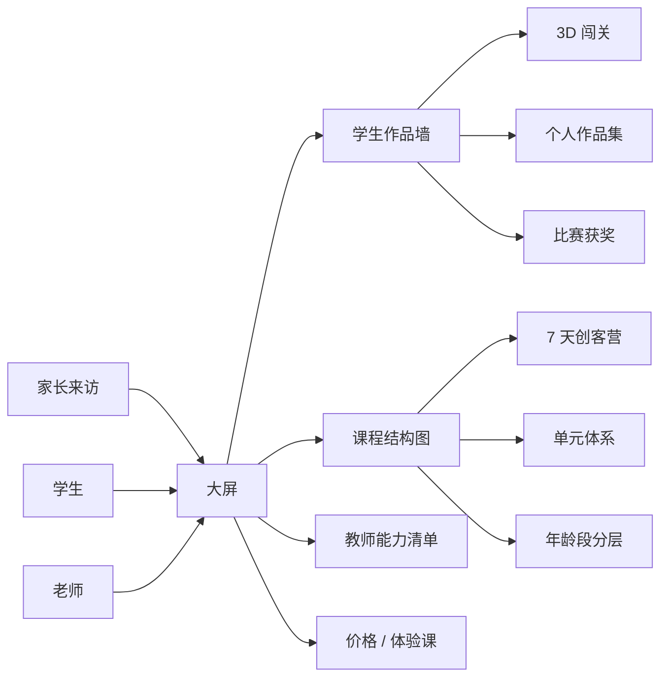

# 乐其翔展览系统

> 把学生作品、课程、价格、教师能力铺在墙上,给家长和学生一个可点可看的"学校门面"。

## 一句话

乐其翔是给机构做的**展览大屏**。家长来访、学校开放日、招生宣传都能用 —— 学生能点开看作品,老师能看课程结构,校长能看到能力清单。

## 实际形态

- 一个固定在大屏 / 触摸屏上的 Web 应用
- 弱网 / 离线也能跑(本地资源)
- 自动轮播学生作品 + 老师手动讲解

## 我从这里学的

- **数据驱动 UI**:所有内容来自 12 个 JSON 文件,改内容不用动代码
- **离线优先**:Service Worker + 资源预热,大屏不依赖网络
- **自带监控**:web-vitals LCP/CLS/INP 监听,不联网

## 看真实档案

想知道技术栈、文件结构、风险、迭代方向 → [[60_Assets/dossiers/open_leqixiang]]