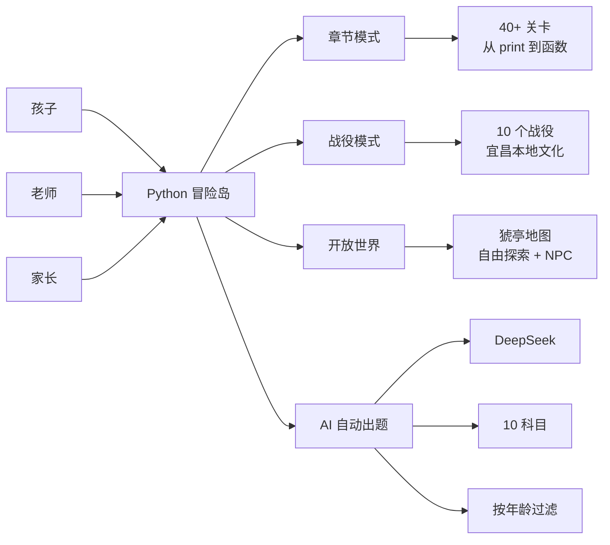

# Python 冒险岛

> 让孩子在冒险中学 Python 的游戏化学习平台。宜昌猇亭本土地理 + AI 自动出题 + 三种模式。

## 一句话

**孩子玩着玩着就会写 Python 了**。三种模式(章节 / 战役 / 开放世界),按年龄分段(小学低 / 小学高 / 初中),AI 出题覆盖 10 科目,跑在浏览器里,部署在云上。

## 三种模式怎么玩

| 模式 | 适合谁 | 内容 |
|---|---|---|
| **章节模式** | 入门 | 8 大章节 40+ 关卡,从 `print` 到函数 |
| **战役模式** | 进阶 | 10 个战役,平台跳跃 + 重力翻转 + Boss 战 + 风力系统 |
| **开放世界** | 喜欢自由探索 | 猇亭地图 + NPC 互动 + 隐藏任务 |

## 为什么这个项目被验证

- **真实部署**:game.codebn.cn 上线,PM2 管理
- **真实用户**:学员在用,作品能上台展示
- **真实 AI**:DeepSeek 接入,出题覆盖 10 科目 × 3 年龄段 × 5 模板
- **真实本地化**:战役背景是宜昌猇亭,小孩有代入感

## 我从这里学的

- **用 Pyodide 在浏览器跑 Python** —— 不用后端也能执行代码
- **按年龄分段的数据层** —— 题库 / 课程 / UI 三层分段
- **复杂游戏版本管理** —— CI 出包 → 宝塔传包 → PM2 重启

## 看真实档案

想知道后端 32 个路由、29 个模型、部署强约束 → [[60_Assets/dossiers/python-adventure]]