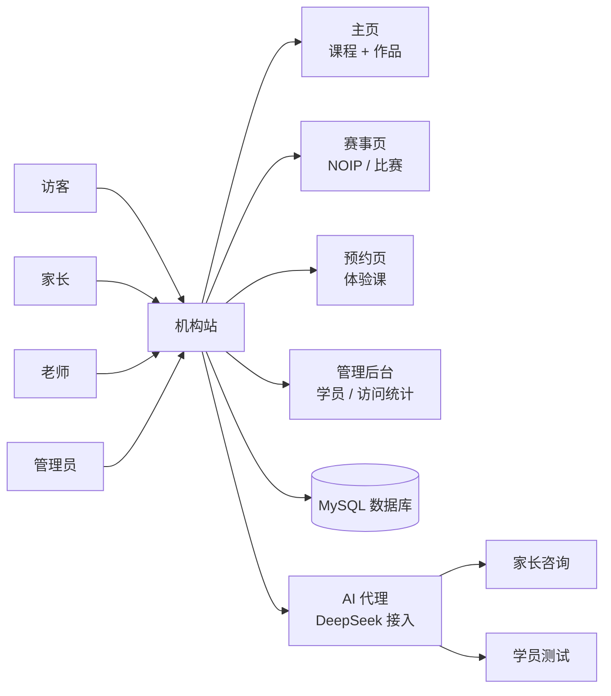

# 智创未来编程学院机构站

> 乐启享的机构门面 + 业务承接站。家长能看到课程和学员作品,老师能管理学员,系统能跑得动。

## 一句话

**机构对外的官网 + 对内的业务系统**。家长能在 1 次点击内看到课堂、作品、抖音,老师能管理学员,系统跑得稳。

## 实际跑什么

- **官网首页**:课程介绍 + 学员作品 + 抖音入口
- **赛事页**:NOIP / 机器人竞赛 / 特长生招生信息
- **预约页**:体验课预约,直接对接客服
- **管理后台**:学员管理 / 访问统计 / 联系人收集
- **AI 咨询**:用 DeepSeek 答疑 + 自动出题

## 部署在哪

- 主站:**senlin-c1n.pages.dev**(Cloudflare Pages)
- 备用:**senlinwebsite.vercel.app**
- 业务域名:codebn.cn / codebona.cn
- 服务器 PM2 部署在 120.26.114.244

## 为什么这个项目重要

- **业务承接**:学员报名 / 家长咨询 / 作品展示 都在这
- **可信度门面**:家长第一眼看到的网站,决定信不信你
- **数据沉淀**:学员数据 / 访问数据 / 抖音导流数据

## 我从这里学的

- **白名单鉴权**:URL 黑名单 + 文件黑名单 + CORS 白名单
- **AI 代理独立进程**:不污染主站代码 + 便于限流
- **多端部署**:Cloudflare / Vercel / 宝塔 PM2 都有兜底

## 看真实档案

想知道 server.js 实现、CORS 配置、AI 代理安全漏洞 → [[60_Assets/dossiers/senlin_website]]