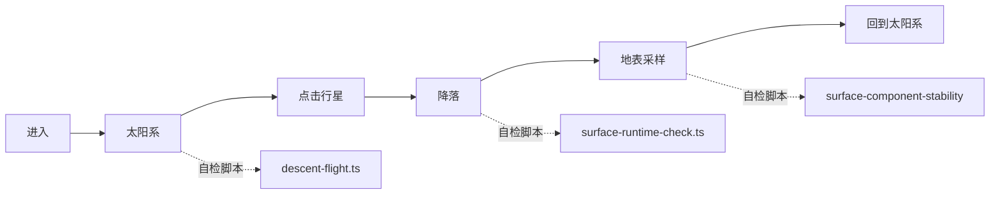

# 宜昌宇宙探索互动站

> 一个能点能飞的 3D 宇宙探索网站,孩子可以在浏览器里"飞"到行星上看地表采样。

## 一句话

**孩子的第一个 3D 互动作品**。从太阳系开始,飞到行星,落地采样,每一步都有真实交互。技术上是 Next.js + Three.js + React Three Fiber 的 3D 前端。

## 孩子能体验什么

1. 进入看到 3D 太阳系动画
2. 点击某个行星(地球 / 火星 / 木星...)
3. 飞船自动飞向目标行星
4. 降到地表,采样岩石 / 大气数据
5. 回到太阳系,继续探索

## 技术亮点

- **纯前端 3D**:Three.js 0.169 + R3F 8 + drei 9
- **流畅动画**:framer-motion 11 做覆盖层
- **多阶段任务**:每个阶段都有独立的 TypeScript 自检脚本
- **轻量部署**:Cloudflare Pages,移动端也能跑

## 用作教学

- 学员第一次接触 3D 编程的范本
- 课堂"3D 编程入门"课程的参考实现
- "宇宙探索营"课件的对接原型

## 我从这里学的

- **R3F 8 + drei 9 的搭配**:做 3D 场景不需要自己写相机 / 控制器
- **多阶段拆解**:每个阶段一个 tsx 自检脚本
- **资源压缩**:启动资源压缩 + 移动端适配是关键

## 看真实档案

想知道完整自检脚本、移动端适配、宜昌博物馆真实馆藏接入 → [[60_Assets/dossiers/world_website]]