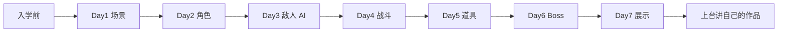

# 3D 动作闯关 · 七天创客营

> 旗舰课程。从零开始,7 天做出一款 3D 动作闯关游戏。

## 一句话

适合有 Python 基础的初中生,从 `Ursina` 第一行代码开始,7 天做出一款可玩的 3D 闯关游戏。学生**真的能上台展示**,不是 PPT。

## 七天怎么走

| 天 | 主题 | 阶段成果 |
|---|---|---|
| Day1 | 3D 世界初探 | 看到 3D 墓地场景 |
| Day2 | 玩家角色 | WASD 移动 + 相机跟随 |
| Day3 | 敌人来袭 | 敌人 AI 追踪 + 状态机 |
| Day4 | 战斗系统 | 攻击判定 + 血量 UI |
| Day5 | 道具与波次 | 完整游戏循环 |
| Day6 | Boss 战 | Boss 技能 + 特效 |
| Day7 | 个性化与展示 | 最终作品评选 |

## 学员画像

- **学段**:初中(7-9 年级)
- **基础**:学过 Python 变量、函数、类
- **人数**:6-10 人 / 班
- **动机**:对游戏开发感兴趣

## 老师材料

- 教案总目录:[C:\教案\25年寒假创赛营\](file:///C:/教案/25年寒假创赛营/)
- 7 天逐日 day1-day7(每个有 starter / complete 两套代码)
- 素材:Kenney Graveyard Kit(`assets/models/graveyard_temp/`)
- 引擎文档:[Ursina](https://www.ursinaengine.org/)

## 学员作品要求

- 可演示的 3D 闯关 demo
- 1 段陈述:"我做的 / 我学的 / 我想怎么改"
- Day7 上台讲自己的作品

## 评估标准

| 维度 | 权重 |
|---|---|
| 完成度 | 40% |
| 创意性 | 30% |
| 代码质量 | 15% |
| 展示表现 | 15% |

## 真实风险

- **路径错误**:必须从 `adventure_game_course/` 根目录运行,不然模型找不到
- **资源读取慢**:GLB 模型多,启动要 2-3 秒
- **Ursina 8.x 兼容**:`application.asset_folder` 必须额外设置

## ISO 化目标

7 天营是我重点课程,但目前教案 / PPT / 源码 / 复盘没成套。**这是 90 天目标**之一。

## 看真实档案

[[60_Assets/dossiers/teaching]] · 7 天营 + 18 单元分类完整数据