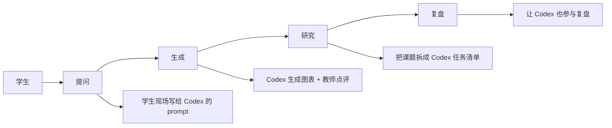

# AI 互动课堂

> 把 Codex / Claude / Airi 拉进课堂,让「提问、生成、研究」变成教室活动。

## 一句话

学生**不需要先会写代码**,只需要会**问问题**。让 AI 助手参与课堂,学生学到的是「**怎么用 AI 做事**」,不是「怎么和 AI 抢饭碗」。

## 课堂怎么走

## 4 节课怎么上

| 节 | 主题 | 核心动作 |
|---|---|---|
| 1 | 提问即探究 | 学生现场写给 Codex 的 prompt |
| 2 | 生成即讲解 | Codex 生成图表 + 教师现场点评 |
| 3 | 研究式学习 | 把课题拆成 Codex 任务清单 |
| 4 | 复盘 | 让 Codex 也参与学生复盘 |

## 学员画像

- **学段**:高一以上(部分初中高年级也能上)
- **基础**:不需要编程基础
- **动机**:对 AI 好奇 / 想用 AI 提效
- **老师 / 家长**可旁听

## 老师材料

- AI 工具档案:[[50_AI/codex]] / [[50_AI/claude-ai]]
- 提示词参考资料:[[70_Sources/vibe-hub/]]
- 智能体实验:[[20_Projects/airi]]

## 学员作品要求

- 至少 10 个高质量 prompt
- 1 个用 Codex 完成的研究报告
- 1 段陈述:"AI 怎么改变了我的学习方式"

## 评估标准

| 维度 | 权重 |
|---|---|
| Prompt 质量 | 30% |
| 研究报告完整度 | 30% |
| 反思深度 | 25% |
| 上台讲解 | 15% |

## 风险与卡点

- **AI 幻觉**:学生容易相信 AI 输出 → 必须训练"质疑 + 验证"能力
- **替代作弊**:有些学生会直接抄 AI 答案 → 改成"用 AI 但说明哪里 AI 错了"
- **网络 / API**:DeepSeek / Claude / OpenAI API 都需要钱

## 我从这里学的

- AI 不会替代老师,但**会用 AI 的老师**会替代不会用 AI 的老师
- 学生学 AI 的最佳起点是**会用 AI 解决自己真正关心的问题**

## 看真实档案

- [[60_Assets/dossiers/teaching]] · 18 单元分类
- [[50_AI/index]] · AI 工具全景