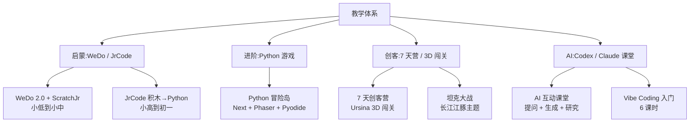

# 教学体系入口

> 教学分四档:启蒙 / 进阶 / 创客 / AI。每一档对应一套真实跑过的课程。

## 教学全景

## 课程定位

| 学段 | 课程 | 技术栈 |
|---|---|---|
| 小学低年级 (1-3) | WeDo 编程启蒙 | 乐高 WeDo + ScratchJr |
| 小学高年级 (4-6) | JrCode 进阶 / Vibe Coding 入门 | Scratch → Python 过渡 |
| 初中 (7-9) | Python 冒险岛 / 7 天创客营 / AI 互动课堂 | Python + Phaser / Ursina / AI API |

## 教学评估标准

| 维度 | 权重 |
|---|---|
| 完成度 | 40% |
| 创意性 | 30% |
| 代码质量 | 15% |
| 展示表现 | 15% |

## 找具体课程卡

- 教学档案:[[60_Assets/dossiers/teaching]]
- 课程卡:见下面 6 张
- 学员作品:[[30_Teaching/_students-mirror]]

## 当前在跑的课程

1. [[30_Teaching/weDo-programming]] · 启蒙,小低到小中
2. [[30_Teaching/jrcode]] · 进阶,小高到初一
3. [[30_Teaching/python-game-course]] · Python 游戏配套
4. [[30_Teaching/adventure-game-3d]] · 7 天创客营旗舰
5. [[30_Teaching/ai-classroom]] · AI 互动课堂
6. [[30_Teaching/course-Vibe-Coding-6]] · Vibe Coding 入门 6 课时