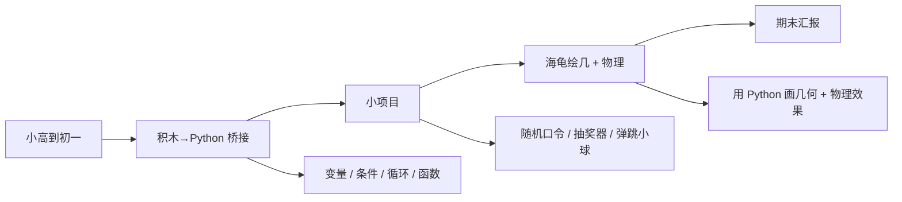

# JrCode 编程进阶

> 把 Scratch 风格的积木代码衔接到 Python 真实代码,并初步建立物理和算法思维。

## 一句话

学完 WeDo / ScratchJr 的孩子,下一步**最容易卡的就是从积木跳到真实代码**。JrCode 是这座桥:用项目把 Python 语法变成"能用"的东西,而不是"要背"的东西。

## 课堂怎么走

## 学员画像

- **学段**:小学高年级到初一(4-7 年级)
- **基础**:WeDo + ScratchJr 完成
- **人数**:6-10 / 班

## 课节表

| 节 | 主题 | 学员成果 |
|---|---|---|
| 1-4 | 积木代码 → Python | 变量 / 条件 / 循环 / 函数 4 个基础语法 |
| 5-8 | 小项目 | 随机口令 / 抽奖器 / 弹跳小球 / 期末汇报选题 |
| 9-12 | 海龟绘几 + 物理 | 用 Python 画几何 + 物理效果 |
| 13-15 | 期末汇报准备 | 1 个可发布的小项目 |
| 16 | 上台讲自己的项目 | 作品 demo + 1 段陈述 |

## 老师材料

- 教案:[C:\教案\教学物料(新版)(1).docx](file:///C:/教案/) (可复用)
- 考核:课堂观察 + 作品 demo

## 学员作品要求

- 至少 3 个小项目(随机口令 / 抽奖器 / 弹跳小球)
- 1 个可发布的小项目(网站 / 游戏 / 工具)
- 上台讲自己的项目

## 评估标准

| 维度 | 权重 |
|---|---|
| 基础语法掌握 | 30% |
| 小项目完成 | 30% |
| 期末汇报项目 | 25% |
| 上台讲解 | 15% |

## 我从这里学的

- 积木 → 真实代码 的桥最难搭,要靠**项目驱动**而不是语法背诵
- 海龟绘几是**最便宜的物理可视化工具**,小学就能用
- 期末汇报是**学完即上台**,不是 PPT

## 看相关

- [[30_Teaching/weDo-programming]] · 学完这个之后可以进的进阶课
- [[30_Teaching/_students-mirror]] · 学员作品记录
- [[30_Teaching/python-game-course]] · 学完这个之后可以进的 Python 游戏课