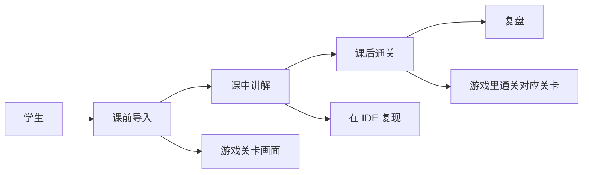

# Python 冒险岛 · 课程配套

> 给**已经能跑通 Python 基础的学生**配套游戏课。在游戏里练编程,在编程里玩游戏。

## 一句话

学生**不用先学完 Python 再玩游戏**。游戏里遇到的关卡就是 Python 知识点:变量 → 条件 → 循环 → 函数 → 类,过完一关等于过完一个语法点。

## 课程结构

## 课节与知识点对照

| 课节 | Python 知识点 | 游戏内体现 |
|---|---|---|
| 1 | 输入输出 + 变量 | 角色对话系统 |
| 2 | 条件 + 循环 | 战斗判定 |
| 3 | 函数 / 列表 / 字典 | 道具栏 / 技能 |
| 4 | 文件 / 异常 | 存档系统 |
| 5 | 类与对象 | 游戏对象实例(敌人 / 道具) |

## 教学适配

- **课前导入**:用游戏关卡画面激发好奇心
- **课中讲解**:学生在 IDE 复现关卡里的逻辑
- **课后**:回到游戏里通关对应关卡

## 老师材料

- 游戏入口:[game.codebn.cn](https://game.codebn.cn)
- 项目卡:[[20_Projects/python-adventure]]
- 真实档案:[[60_Assets/dossiers/python-adventure]]
- 部署文档:C:\kaifa\game-google\MAINTENANCE.md

## 学员作品要求

- 至少通关 8 大章节 / 40+ 关卡
- 用代码修改过至少 1 个关卡(创意工坊)
- 上台讲自己改过的关卡

## 评估标准

| 维度 | 权重 |
|---|---|
| 通关进度 | 30% |
| 代码修改 | 30% |
| 创意工坊作品 | 25% |
| 上台讲解 | 15% |

## 我从这里学的

- **游戏化学习**比刷题更有效
- **AI 出题**(DeepSeek)能按年级自动生成练习
- **真实部署**(game.codebn.cn)给学员可见的成果

## 风险与卡点

- 服务器维护成本(120.26.114.244 / PM2 / 端口冲突)
- v2.4.7 vs package.json v2.3.0 版本号不一致

## 看真实档案

- [[20_Projects/python-adventure]] · 项目卡
- [[60_Assets/dossiers/python-adventure]] · 真实档案(后端 32 个路由 + 29 个模型)