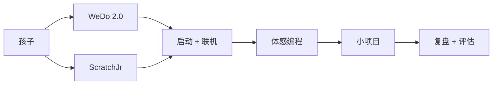

# WeDo 编程启蒙

> 通过乐高 WeDo 2.0 + ScratchJr,把「写代码能动」变成真实可见。

## 一句话

小学低年级孩子**不会写代码**,但他们能**拖积木 + 拼乐高**。WeDo 让"代码"变成"马达动了 / 灯亮了 / 倾斜了",孩子立刻看到反馈。

## 课堂怎么走

## 学员画像

- **学段**:小学低年级到小中(1-3 年级为主)
- **基础**:图形化 + 命令行萌芽
- **人数**:6-10 人 / 班
- **学具**:乐高 WeDo 2.0 套件

## 课节表

| 节 | 主题 | 学员成果 |
|---|---|---|
| 1 | 启动 WeDo + ScratchJr | 联机 + 一个简单马达动作 |
| 2 | 体感编程 | 马达 / 声音 / 倾斜三选一 |
| 3 | 小项目:旋转木马 | 1 个可演示作品 |
| 4 | 小项目:智能风扇 | 1 个可演示作品 |
| 5 | 小项目:巡线小车 | 1 个可演示作品 |
| 6 | 复盘 + 评估 | 作品的 3 张图 + 1 段话 |

## 老师材料

- 教案:[C:\教案\P1 几何王国 教案.docx](file:///C:/教案/) (可复用)
- 教具:乐高 WeDo 2.0 套件
- ScratchJr 应用(平板)

## 学员作品要求

- 至少 1 个可演示的可视化项目
- 1 段陈述:"我做的 / 我学的 / 我想怎么变"

## 评估标准

| 维度 | 权重 |
|---|---|
| 项目完成度 | 40% |
| 创意 | 30% |
| 陈述表达 | 30% |

## 风险与替代

- **设备联不上**:准备 USB 直连代替蓝牙
- **学生不会**:"双胞胎"结对 + 教师 shadow
- **家长不配合**:把作品发群里,让家长参与

## 我从这里学的

- 低龄孩子学编程**不能从屏幕开始**,要从**动手**开始
- WeDo 的"马达动了"反馈比屏幕上的 print 强 10 倍

## 看相关

- [[30_Teaching/jrcode]] · 学完这个之后可以进的进阶课
- [[30_Teaching/_students-mirror]] · 学员作品记录