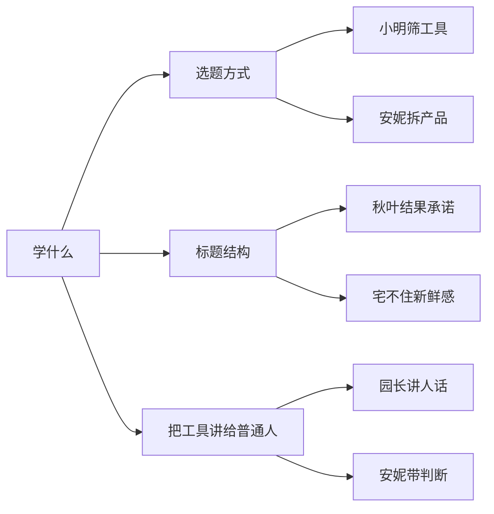

# 对标账号池(愈见森林)

> 只对标"AI 工具 / GitHub 项目 / 普通人能马上上手"的账号。**不**对标:强卖课 / 强导私域 / 纯开发者圈自嗨 / 只报新闻不讲怎么用。

## 一句话

对标不是为了抄标题,是为了**学怎么把"工具"翻译成"普通用户能用的话"**。5 个长期监测账号,各有侧重点。

## 5 个对标账号

| 账号 | 抖音号 | 粉丝 | 值得学 |
|---|---|---|---|
| **AI课代表小明** | 965106105 | 219.6 万 | 筛工具 / 标题结构 / 系列感 |
| **秋叶 AI-表姐** | Qiuye_Ai | 402.1 万 | 普通人入口 / 结果承诺 |
| **安妮说 AI** | taotaoTaki | 145.7 万 | 产品经理式拆工具 / 判断感 |
| **宅不住的 AI** | ZHAIBUZHU123 | 94.5 万 | 新鲜感 / 体验 / 实测 |
| **园长说 AI** | Sq19980929 | 100.4 万 | 门槛低但不低级 / 人设 |

## 监测什么

每天监测时要看的 5 个点:

1. **最近 3 条** 在讲什么工具 / 项目
2. **标题** 常用"结果词"还是"工具词"
3. **同一工具** 有没有被拆成多场景
4. **最常服务** 的是谁
5. **蹭热点 vs 收藏**:哪些在蹭,哪些在做长尾收藏

## 愈见森林该学什么

## 愈见森林不该学什么

- 不学**强卖课**(秋叶后期)
- 不学**过度夸张**("颠覆""天塌了")
- 不学**只会喊口号**
- 不学**空洞新闻播报**

## 对标数据更新节奏

- **每月 1 号**:复盘 5 个账号最近 30 天数据
- **每季度**:砍 1-2 个弱的 + 加 1-2 个新的
- **每 6 个月**:看是否整体调换对标池

## 自动化

C:\kaifa_senlin\douyin\accounts\yujian-senlin\automation\yujian-senlin-automation-runbook.md 有完整的"早间脚本 + 夜间复盘"流水线,落地后可以减少手动监测。

## 看真实档案

[[60_Assets/dossiers/douyin]] · 包含 benchmark_accounts 原文 + automation runbook