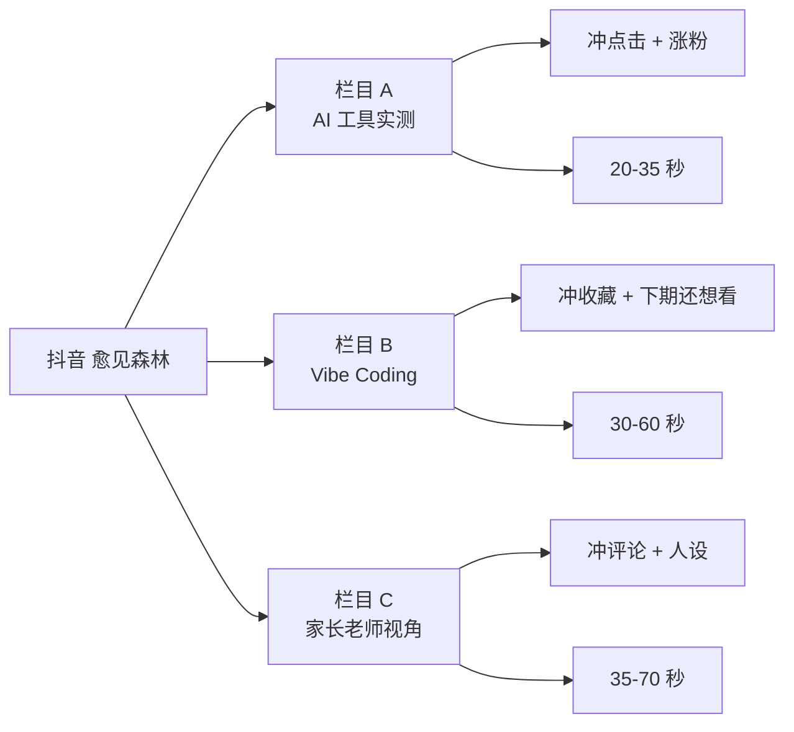

# 固定 3 个栏目

> 抖音不是"今天拍一条明天拍一条",是"3 个固定栏目按节奏跑"。

## 一句话

3 个栏目对应**3 种不同目标**:冲点击 / 冲收藏 / 冲人设。每个栏目有自己的长度 / 选题规则 / 标题模板,不让每天从零想。

## 栏目矩阵

## 栏目 A · AI 工具实测

- **长度**:20-35 秒
- **目标**:冲点击 + 涨粉
- **选题规则**:今天发布的工具 + 主要适用对象 + 上手需多少时间
- **标题方向**:学生现在就能用的 AI 神器 / 老师别错过这个 AI 工具 / 这个免费开源工具,真能省时间
- **发布节奏**:每天第一条(11:30-12:30)

## 栏目 B · 30 分钟 Vibe Coding

- **长度**:30-60 秒
- **目标**:冲收藏 + "下期还想看"
- **选题规则**:一个明确需求 + 可言不可言的 3 阶段
- **标题方向**:零基础也能做的 AI 小工具 / 30 分钟做完这个网站 / 用一句话把这个需求做出来
- **发布节奏**:每天第二条(19:50-20:40)

## 栏目 C · 家长老师视角

- **长度**:35-70 秒
- **目标**:冲评论 + 人设
- **选题规则**:AI 对家长 / 老师的具体影响
- **标题方向**:真正会被 AI 拉开差距的不是差生 / 家长现在最该补的不是编程 / 老师最先该学会的不是更会讲题
- **发布节奏**:穿插(每周 2-3 条)

## 选题打分(5 项 × 5 分)

| 维度 | 5 分 | 0 分 |
|---|---|---|
| 最近 7 天内够不够新 | 今天发布 | 1 周前的老工具 |
| 8 秒内能不能看懂结果 | 截图立刻看懂 | 需要解释 |
| 普通人能不能马上理解价值 | 1 句话讲完 | 要解释 30 秒 |
| 有没有官方站 / GitHub 仓库 | 都有 | 都没有 |
| 能不能延展成至少 3 条系列 | 至少 3 条 | 单条就用完 |

**总分 < 18 不拍**。

## 每天 8 个动作

1. 07:30-08:10 热点扫描
2. 08:10-08:30 题材打分
3. 08:30-09:00 写钩子(3 个开头 + 3 个封面大字)
4. 09:30-11:00 录制第一条
5. 11:30-12:30 发布第一条
6. 13:00-13:30 第一轮看数
7. 16:00-18:00 录制第二条
8. 19:30-21:30 发布第二条
9. 22:00-22:30 夜间复盘(6 个问题)

## 真实卡点

- **栏目 A 太挤**:AI 工具每天都有,容易陷入"工具堆砌"
- **栏目 B 难度大**:30 分钟做网站,要求我**先把结果跑通**再录
- **栏目 C 容易踩红线**:观点类内容新粉率最低,要克制

## 看真实档案

[[60_Assets/dossiers/douyin]] · 30-day 计划 + 14-day 冲刺 + 7 篇 daily_outputs