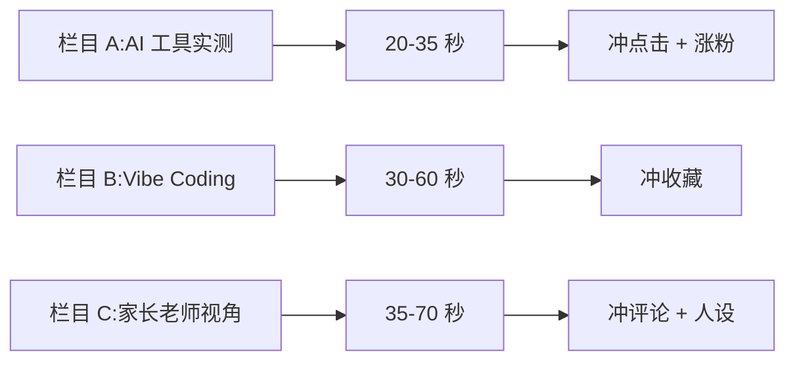

# 愈见森林 · 抖音主账号

> 我的抖音主账号。账号承诺:**每天一个 AI 工具或 Vibe Coding 实战**,帮学生、家长、老师看懂什么值得学、马上怎么用、未来会怎么变。

## 一句话

**这不是科技评论号,是"学生 / 家长 / 老师 + AI 工具实战"号**。用户来不是为了听宏观观点,是为了看到"现在能用"的工具。

## 账号快照

| 维度 | 当前 | 年度目标 |
|---|---|---|
| 抖音号 | 79212093120 | - |
| 粉丝 | 151 | 10000 |
| 获赞 | 2246 | 5000+ |
| 作品 | 66 | 累计 500+ |
| 历史最高单条 | 4.7 万播放 | - |
| 新粉率 | 约 0.2% | 0.8% |

## 主定位

> **每天一个 AI 工具或 Vibe Coding 实战**,帮学生、家长、老师看懂什么值得学、马上怎么用、未来会怎么变。

- **主受众**:学生 / 想跟上 AI 的年轻家长 / 愿意尝试新工具的老师
- **次受众**:对 AI 教育和技术趋势有兴趣的科技圈用户

## 内容占比

- **45-50%** AI 工具 / 开源神器实测
- **30-35%** Vibe Coding / 建站 / 自动化实战
- **20%** 教育、学习、职业变化判断

## 三大固定栏目

| 栏目 | 长度 | 目标 | 标题方向 |
|---|---|---|---|
| AI 工具实测 | 20-35 秒 | 冲点击 + 涨粉 | 学生现在就能用的 AI 神器 / 老师别错过这个 AI 工具 |
| Vibe Coding | 30-60 秒 | 冲收藏 | 30 分钟做完这个网站 / 零基础也能做的 AI 小工具 |
| 家长老师视角 | 35-70 秒 | 冲评论 + 人设 | 真正会被 AI 拉开差距的不是差生 |

## 每日 SOP

8 个动作 / 选题打分 5 项 × 5 分 = 25(总分 < 18 不拍)。

详见 [[60_Assets/dossiers/douyin]]。

## 关键监测指标

| 指标 | 用途 |
|---|---|
| 播放量 | 推荐链路有没有打开 |
| 收藏率 | "留着以后用"的价值 |
| 新粉率 | 新粉数 / 播放量(目标 0.8%) |
| 主页访问率 | 视频有没有把人带回主页 |
| 完播率 | 开头和节奏有没有留住人 |

## 真实卡点

- **新粉率 0.2% → 0.8%** 是最关键的杠杆
- **主页人设不明显** → 主页要重做
- **标题还在"教程名"** 而不是"结果承诺"

## 下一步

- [ ] 主页置顶 3 条视频:自我介绍 / 最强工具型爆款 / 最强 Vibe Coding 成果
- [ ] 封面大字固定三类:真人 + 结果承诺 / 工具画面 + 适用人群 / 前后对比 + 收益
- [ ] 每周一次评论区答疑

## 看真实档案

[[60_Assets/dossiers/douyin]] · 30-day 计划 + 14-day 冲刺 + 7 篇 daily_outputs + 5 个对标账号