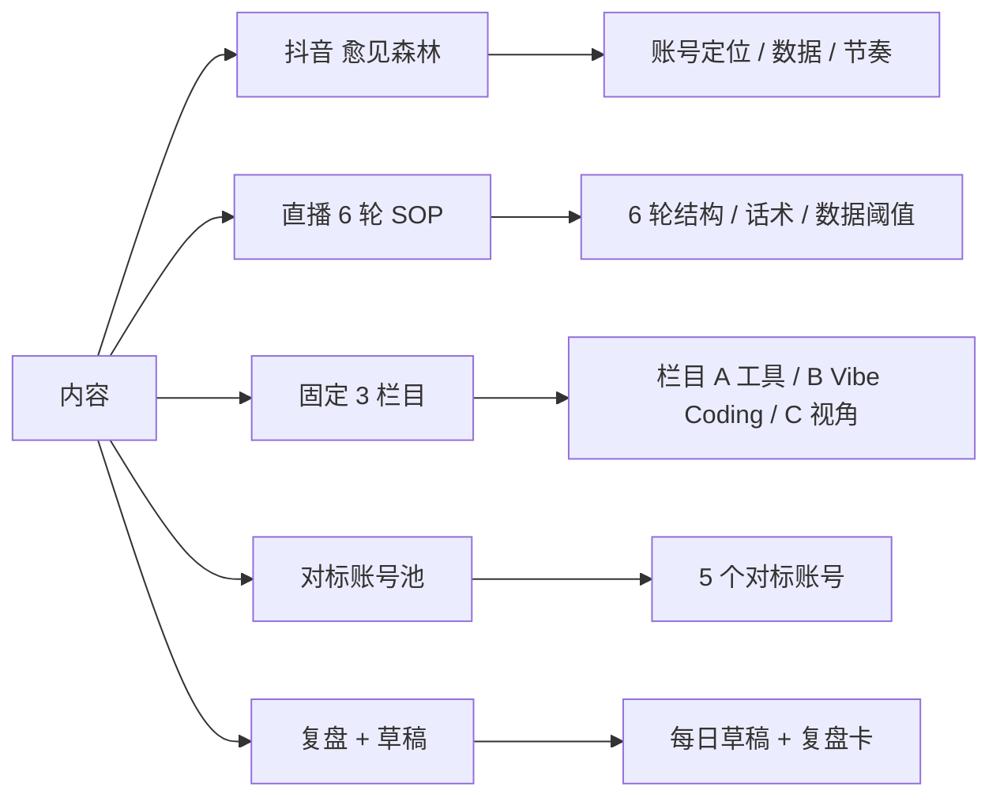

# 内容体系入口

> 抖音「愈见森林」+ 直播 + 抖音脚本 + 对标账号池 = 我的内容体系。

## 内容全景



## 找具体内容

- 抖音档案:[[60_Assets/dossiers/douyin]] · 151 → 10000 粉路径
- 直播档案:[[60_Assets/dossiers/live-streaming]] · 6 轮数据驱动 SOP
- 抖音账号数据:[[40_Content/curerforest-channel]]
- 直播 SOP:[[40_Content/live-sop-six-round]]
- 固定栏目:[[40_Content/columns]]
- 对标账号:[[40_Content/benchmarks]]
- 草稿:[[40_Content/draft-2026-07-27]]
- 复盘:[[40_Content/live/2026-07-28]]

## 内容转化链

```
项目 / 课堂现场
  ↓
一条短视频(20-60 秒)
  ↓
一场直播(2 小时)
  ↓
一篇复盘
  ↓
一张可复用知识卡(进 dossier)
```

## 新内容最低记录

新建一张内容卡前,至少写清楚:
- **目标受众**和要解决的问题
- **开头、核心演示和行动指令**
- **发布日期、播放、互动、涨粉和转化**
- **哪一部分可以进入课程或下一条内容**

## 入口也看

- [[00_Home/MOCs/content]] · 内容 MOC
- [[00_Home/MOCs/projects]] · 项目 MOC
- [[00_Home/MOCs/teaching]] · 教学 MOC