# 六轮直播 SOP(主战场)

> 单场 2 小时拆 6 轮,每轮 15-30 分钟。从信任破冰到终极清库存,全程"评论→关注→灯牌→看小黄车"。

## 一句话

**6 轮结构把"信任 + 价值 + 紧迫 + 保障 + 倒计时 + 互动"打包成可复用流程**。在线人数分档(< 10 / 10-30 / 30-60)切换不同憋单节奏,每 3-5 分钟播报数据触发加推。

## 6 轮结构

```mermaid
gantt
    title 单场 2 小时直播(6 轮结构)
    dateFormat HH:mm
    axisFormat %H:%M

    section 第1轮
    信任破冰 + 数据起步 :a1, 00:00, 15m
    section 第2轮
    价值塑造 + PBL 输出 :a2, after a1, 15m
    section 第3轮
    五分钟成交 :a3, after a2, 15m
    section 第4轮
    痛点刺激 + 案例 :a4, after a3, 25m
    section 第5轮
    未来格局 + 锚点 :a5, after a4, 20m
    section 第6轮
    终极冲刺 :a6, after a5, 30m
```

## 每轮关键动作

| 轮 | 时间 | 核心动作 | 数据目标 |
|---|---|---|---|
| 1 | 00:00-00:15 | 信任破冰 + 数据起步 | 停留 1.5-2 分钟,评论率 8-10%, 关注 5%, 灯牌 3%, CTR 15% |
| 2 | 00:15-00:30 | 价值塑造 + 项目化 PBL | 停留 ≥ 1.5 分钟,评论率冲 10% |
| 3 | 00:30-00:45 | 五分钟成交(福利→紧迫→保障→倒计时) | CTR ≥ 15%, 下单率 ≥ 12% |
| 4 | 00:45-01:10 | 痛点刺激 + 案例见证 | 评论率冲 10%, 停留 ≥ 1.5 分钟 |
| 5 | 01:10-01:30 | 未来格局 + 价值锚点 | 点赞破 3000/5000 加推名额 |
| 6 | 01:30-02:00 | 终极冲刺 + 清库存 | 60/45/30/10 倒计时 |

## 互动顺序(死规则)

1. **评论**
2. **关注**
3. **灯牌**
4. **看小黄车**

## 在线人数分档憋单

| 在线 | 策略 |
|---|---|
| < 10 人 | 聊天成交 + 频弹链接,短逻辑快节奏 |
| 10-30 人 | 微憋单,弹链接不讲长逻辑 |
| 30-60 人 | 严格五分钟成交,先讲价值不放单 |

## 数据触发器

- 评论率 ≥ 8%:加推资料福袋
- 点赞破 1000/3000/5000:加推名额
- CTR ≥ 12% 但 < 15%:切屏小黄车 30-45 秒
- CTR ≥ 15%:准备第一次五分钟成交节奏
- 下单数 ≥ 5:立刻二次加推 +5 名额并公布"最后库存"
- 评论连续 ≥ 10 条/分钟:进入福利→紧迫→保障→倒计时

## 五分钟成交结构(轮 3 / 轮 5 / 轮 6 通用)

1. **福利锚点**:19.9 元两节 / 线下 39.9 元一节,前 5 位加送 AI 体验课
2. **紧迫感(稀缺制造)**:看公屏 + 后台,库存 15 个在线 85 人
3. **保障(零风险试错)**:30 天无忧退,第一节不值第二节不上直接退
4. **倒计时 60/45/30/10**:前 3 位再送一节 AI 体验课

## 核心话术摘录

- **开场**:"猇亭的家长朋友们晚上好!我是乐博士的刘校长。今天不卖货,就做一件事:帮孩子找到比手机更有成就感的兴趣!"
- **灯牌理由**:"灯牌=VIP 通道。粉丝群定期发独家资料与学习计划;点亮灯牌截图私信,我给你 VIP 答疑"
- **看小黄车理由**:"我们线下 39.9 元/节体验,今天直播直接 '119.9 两节'"
- **案例见证**:"内向孩子半年蜕变、逻辑带动数学提升 30 分、参加机器人赛事获奖、自己做游戏当小老师"

## 完整脚本位置

- C:\直播数据复盘笔记\六轮完整直播脚本话术-数据驱动版(上半场).md
- C:\直播数据复盘笔记\六轮完整直播脚本话术-数据驱动版(下半场).md
- C:\直播数据复盘笔记\直播数据复盘投流笔记.md

## 看真实档案

[[60_Assets/dossiers/live-streaming]] · 8 个脚本 + 6 张截图 + 三套版本