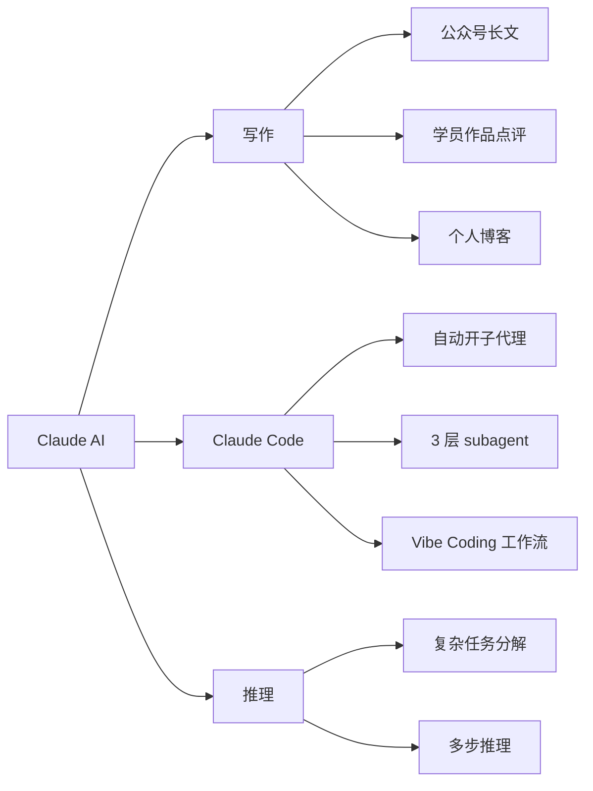

# Claude AI / Claude Code

> Anthropic 出品的大模型。**写代码 + 写文案 + 推理** 都很强,特别适合长上下文。

## 一句话

Claude 在**长上下文**(百万级 token)和**写作自然度**上比 GPT / DeepSeek 强。我用它写公众号 / 长文章 / 复杂代码,也用 Claude Code 跑项目。

## 我用它做什么

## Claude Code 关键能力

- **自动开 3 层子代理**(2025-07 升级):subagents 默认 depth=3(以前是 1)
- **速度档放开**:fast mode 也能用 Opus 5
- **2.1.219 / 2.1.220**:稳定版

## 真实应用

- 公众号 / 长文章
- 学员作品 review(语言组织能力比 GPT 强)
- Claude Code 跑项目:我自己用得少,主要是参考

## vs Codex

| 维度 | Claude | Codex |
|---|---|---|
| 长上下文 | 百万级 | 普通 |
| 写作自然度 | 强 | 一般 |
| 代码能力 | 强(尤其 Python) | 强(尤其 TypeScript) |
| 价格 | 偏贵 | 中等 |
| 桌面应用 | Claude Code | Codex++ |

## 价格

- Opus 5 输入:`$10/M tokens`
- Opus 5 输出:`$50/M tokens`
- Sonnet 输入:`$3/M tokens`(性价比高)
- fast mode:$10/$50 per Mtok

## 关键事件(2025-07)

- Claude Code 升级到 2.1.219
- 把 Opus 5 设为默认 Opus 模型
- 百万级上下文放开
- 速度档 fast mode 也接入 Opus 5
- 子代理能开 3 层

## 看相关

- [[50_AI/codex]] · 主开发助手
- [[50_AI/deepseek-api]] · 自动出题主力
- [[40_Content/curerforest-channel]] · 抖音近期讲 Claude Code 的几条