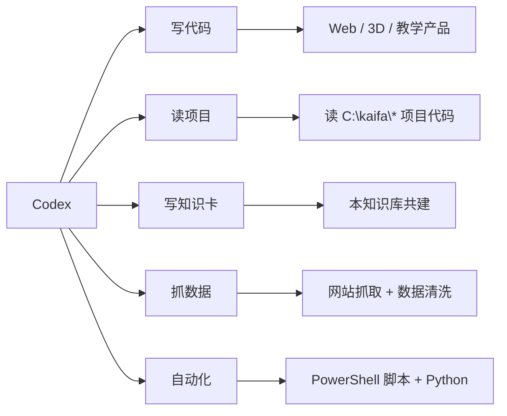
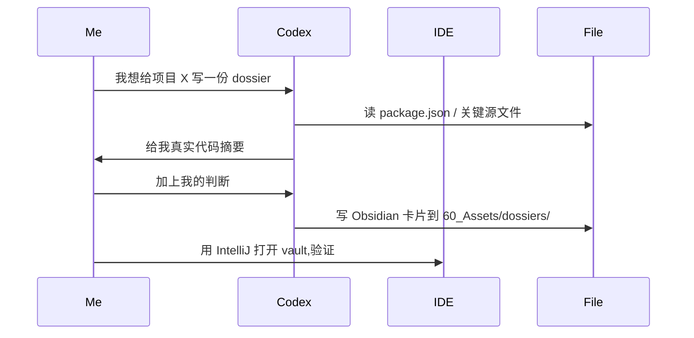

# Codex

> 我的**主开发助手** + **知识库共建助手** + **自动化工具**。92 个会话已落档可检索。

## 一句话

Codex 是 OpenAI 出品的代码 + 推理助手,在桌面 Codex++ 里跑。我用它**写代码 / 读项目 / 写知识卡 / 抓数据 / 自动化**。92 个会话已经落档成 JSON,下次出问题可以直接搜。

## 我用它做什么

## 真实数据

- **会话总数**:92 个(2026-07-27 之前)
- **落档位置**:`[[60_Assets/codex-session-digest.json]]` + `[[60_Assets/codex-session-summary.md]]`
- **高频主题**:PPT / Godot / open_leqixiang / karpathy skills / Scrapling / world_website / 抖音 / Vibe Coding
- **高频工具**:PowerShell / Hero / Godot / Vite / Codex 工具调用

## 我的使用模式

| 场景 | 怎么用 |
|---|---|
| **写代码** | 直接对话 → 生成代码 → 复制到 IDE |
| **读项目** | 让 Codex 读文件路径 → 给我摘要 |
| **写知识卡** | 让 Codex 把项目档案写成 Obsidian 卡片 |
| **抓数据** | Codex 写 Python 抓取脚本 → 本地跑 |
| **自动化** | Codex 写 PowerShell / Python 脚本 → 任务面板跑 |

## 关键优势

- **理解上下文**:能跨多个文件读 + 总结,不用我手动复制粘贴
- **改代码**:能编辑现有项目,而不是只生成新文件
- **接工具**:能调用 shell / 文件系统 / 网络
- **桌面 GUI**:在 Codex++ 1.2.23 桌面应用里跑,可视化

## 关键限制

- **不能跨会话记忆**:每次新会话要重读上下文
- **Windows 路径敏感**:反斜杠在 PowerShell 命令里要小心
- **大文件读不动**:超过 token 限制的文件读不全
- **幻觉**:技术细节(版本号 / 函数名)有时错,必须验证

## 我的工作流

## 看相关

- [[60_Assets/codex-session-digest.json]] · 会话主题统计
- [[50_AI/codex-browser]] · 浏览器模式
- [[50_AI/codex-computer-use]] · 桌面控制
- [[50_AI/claude-ai]] · 内容创作替代