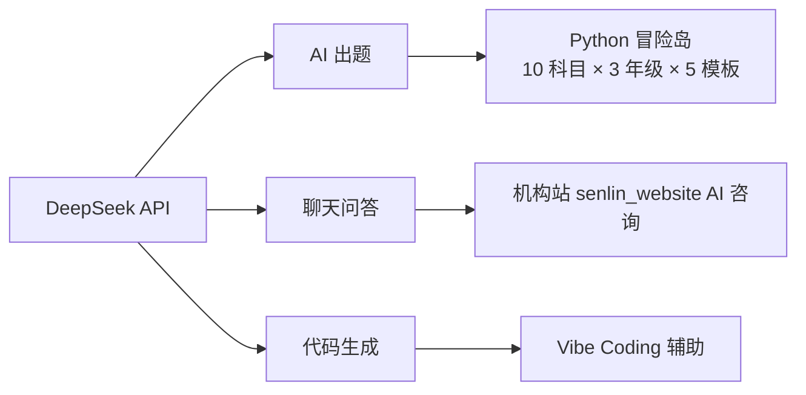
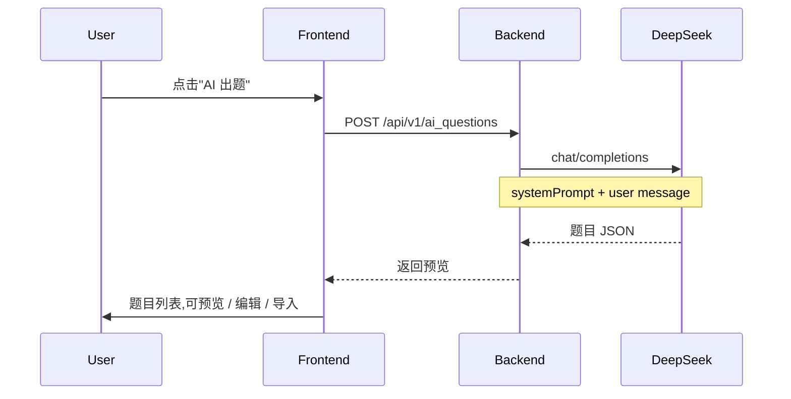

# DeepSeek API

> 在 Python 冒险岛里给学员自动出题。按年龄段切题库,覆盖 10 科目 × 3 年级 × 5 模板。

## 一句话

DeepSeek 是国产大模型 API,**便宜 + 中文好**。我用它给 Python 冒险岛自动出题(数学 / 语文 / 英语 / Python / Scratch 等 10 科),效果稳定。

## 我用它做什么

## Python 冒险岛出题流程

## 配置位置

- **后端**:`C:\kaifa\game-google\backend\.env`
- **环境变量**:
  - `DEEPSEEK_API_KEY=sk-...`
  - `DEEPSEEK_API_URL=https://api.deepseek.com/v1/chat/completions`
  - `DEEPSEEK_MODEL=deepseek-chat`
- **代理**(机构站):`C:\kaifa\my_website\ai-proxy.js`,端口 3001,只允许白名单 origin

## 题库覆盖

| 分类 | 数量 | 备注 |
|---|---|---|
| 科目 | 10 | 数学 / 语文 / 英语 / 物理 / 化学 / Python / Scratch / 趣味推理 / 趣味历史 / 科学常识 |
| 年级分组 | 3 | 小学低年级(1-3) / 小学高年级(4-6) / 初中(7-9) |
| 模板 | 5 | 口算 / 成语 / 单词 / 脑筋急转弯 / 历史趣闻 |

**物理 / 化学** 只对初中显示。

## 价格与限制

- 输入:`¥1/M tokens`(缓存命中更便宜)
- 输出:`¥2/M tokens`
- max_tokens:200-2000
- temperature:0.3(出题要稳定)

## 真实风险

- **API key 暴露**:ai-proxy.js 把 key 用 base64 编码(严重漏洞,要改 env)
- **成本**:每道题 200 tokens,大量出题要小心
- **幻觉**:数学题偶尔算错,必须人工 review

## 未来计划

- [ ] **v2.5**:本地 LLM 替掉 DeepSeek,省钱
- [ ] 把出题 prompt 模板化,便于其它项目复用
- [ ] 学员作品评测接入

## 看相关

- [[20_Projects/python-adventure]] · 用 DeepSeek 出题的游戏
- [[20_Projects/senlin_website]] · 用 DeepSeek 做 AI 咨询
- [[60_Assets/dossiers/python-adventure]] · 真实档案