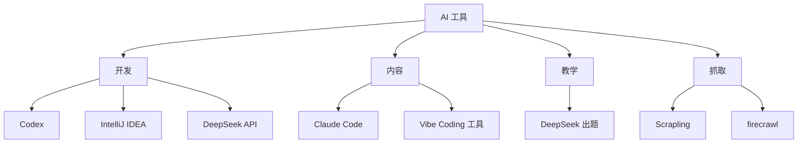

# AI 工具入口

> 我日常用的 AI 工具和工作流。每个新工具进我的工作流前,先写档案。

## 工具全景

## 工具卡

- [[50_AI/codex]] · 主开发助手 + 知识库共建
- [[50_AI/claude-ai]] · 内容创作 + Claude Code
- [[50_AI/deepseek-api]] · Python 冒险岛出题
- [[50_AI/intellij-idea]] · 工程入口 + 编译运行测试
- [[50_AI/vibe-hub]] · AI 大白话学习资料(484 页离线)
- [[50_AI/codex-browser]] · Codex 浏览器模式
- [[50_AI/codex-computer-use]] · Codex 桌面控制
- [[50_AI/AI编程学习路线]] · 从小白到能写 AI 项目的路径

## Codex 会话数据

- 会话总数:**92 个**
- 摘要:`[[60_Assets/codex-session-summary]]`
- 主题统计:`[[60_Assets/codex-session-digest]]`

## 评测口径

每个新 AI 工具进入我的工作流前,先写一张工具卡,回答:
- 用途 / 谁用 / 替代什么
- 风险 / 替代方案
- 真实项目验证

不写工具卡就不算"掌握"。

## 看相关

- [[60_Assets/dossiers/]] · 7 个核心项目档案,每个都用到了 AI
- [[00_Home/MOCs/ai_tools]] · AI 工具 MOC 入口(简版)