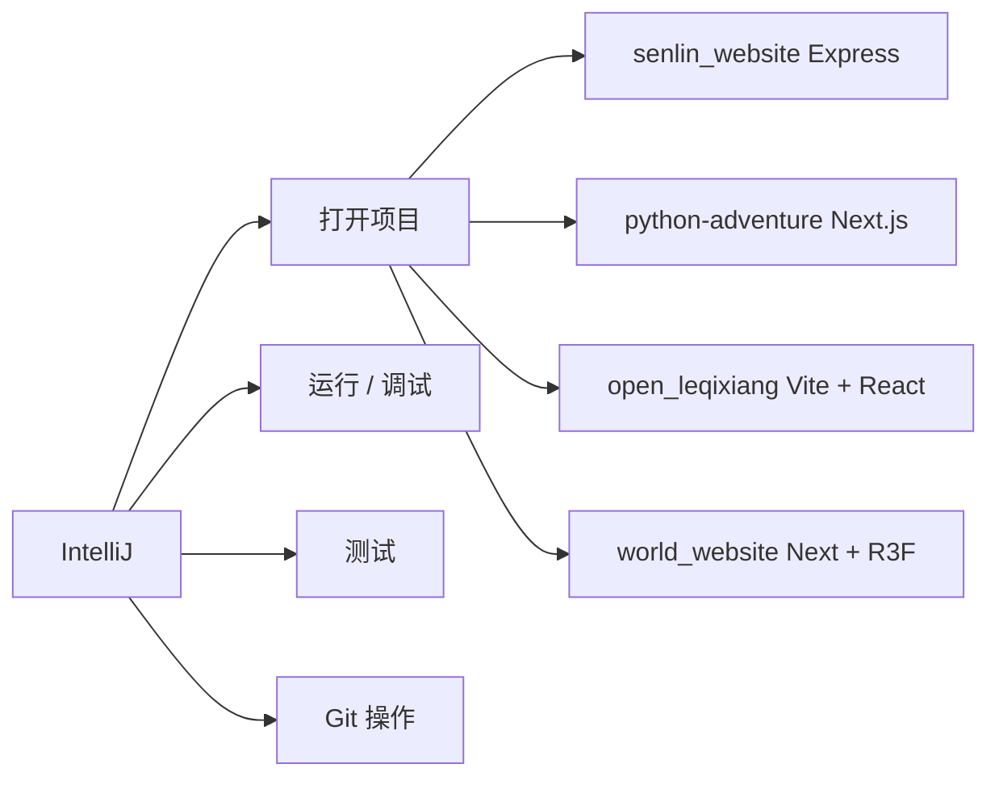

# IntelliJ IDEA 2026.1

> 我日常用的 IDE,**打开 / 编译 / 运行 / 测试 / 调试** 全栈 Java / Kotlin / Python / TS / Web 项目都靠它。

## 一句话

IntelliJ 是工程入口。Codex 帮我分析 + 写代码,IntelliJ 帮我**跑起来 + 调 bug + 测接口**。两者是 AI 时代的最佳搭档。

## 基本信息

| 维度 | 值 |
|---|---|
| 版本 | IntelliJ IDEA 2026.1 |
| Build | 261.22158.277 |
| Edition | Ultimate |
| 路径 | `C:\Users\Administrator\AppData\Local\JetBrains\IntelliJ IDEA 2026.1\bin\idea64.exe` |
| 桌面快捷方式 | `C:\Users\Public\Desktop\IntelliJ IDEA 2026.1.lnk` |

## 我用它做什么



## 跟 Codex 的分工

| 任务 | 用谁 |
|---|---|
| 读项目代码 | **Codex** |
| 写新功能 / 改代码 | **Codex** |
| 跑 build / dev server | **IntelliJ** |
| 调 bug / 看 log | **IntelliJ** |
| 跑测试 / 覆盖率 | **IntelliJ** |
| Git commit / push | 都可以,Codex 更方便 |
| 看 Dashboard / 截图 | **浏览器 / Playwright** |

## vs 其他 IDE

| IDE | 我为什么不用 |
|---|---|
| VS Code | 启动慢 / 内存大 / 调试不如 IntelliJ |
| Trae | 2025-2026 已弃用(归档到 [[90_Archive/trea-cn]]) |
| Cursor | 跟 Codex 重叠,没明显优势 |
| WebStorm | 子集,IntelliJ Ultimate 已经包含 |

## 我的工作流

```
Codex 帮我:
  读项目 → 写代码 → 改代码 → 写卡片

IntelliJ 帮我:
  打开项目 → npm run dev → 跑测试 → 看 log → 调试

两者衔接:
  Codex 写到 .md 卡 → IntelliJ 验证代码 → Codex 重新读 → 循环
```

## 看相关

- [[50_AI/codex]] · 主开发助手
- [[20_Projects/]] · 7 个核心项目都在 IntelliJ 里开