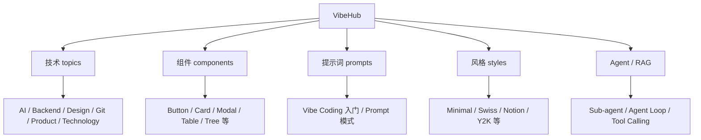
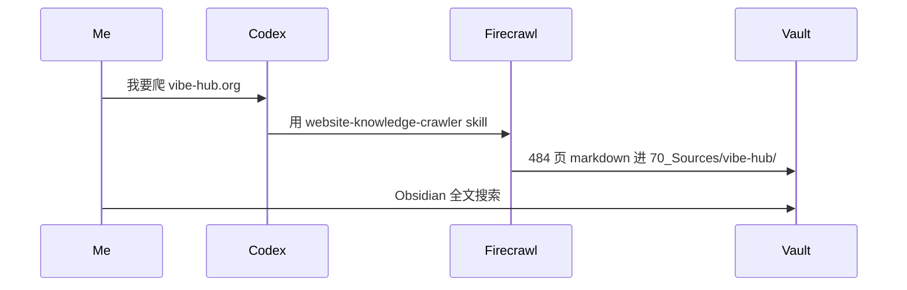

# VibeHub 离线资料

> [vibe-hub.org](https://vibe-hub.org) 的**全站离线镜像**。484 页(中文 242 + 英文 242),AI 编程大白话学习资料。

## 一句话

VibeHub 是**用大白话讲 AI 编程概念**的资料站。我用 firecrawl 全站抓取下来,本地可以直接读。**我的 AI 入门 + 抖音脚本参考都从这里取材**。

## 资料规模

- 总页数:**484 页**
- 中文:242 页
- 英文:242 页
- 抓取方式:`firecrawl` 全站爬取
- 抓取脚本:`[[50_AI/_skills/website-knowledge-crawler]]`
- 位置:`[[70_Sources/vibe-hub/]]`

## 内容分布

## 我怎么用它

| 用途 | 怎么用 |
|---|---|
| **学新概念** | Agent / RAG / Tool Calling 等从 `topics/ai.md` 读起 |
| **写抖音脚本** | 找"普通人能 8 秒看懂"的钩子 |
| **选 UI 组件** | `components/` 找参考 |
| **选视觉风格** | `styles/` 找方向 |
| **写 prompt** | `vibe-coding.md` + `system-prompt.md` |

## 高频使用的页

- `topics/ai.md` · AI 术语大全
- `agent-loop.md` / `sub-agent.md` · Agent 设计
- `tool-calling.md` · 工具调用
- `vibe-coding.md` · Vibe Coding 是什么
- `token-cost.md` · Token 成本治理
- `system-prompt.md` · 系统提示词

## 抓取流程

## 注意事项

- **不进 GitHub**(`.gitignore` 已配置)
- **不修改原文**(留作可检索资料库)
- **本地路径**:`[[70_Sources/vibe-hub/README]]`

## 看相关

- [[50_AI/_skills/website-knowledge-crawler]] · 抓取 skill
- [[70_Sources/vibe-hub/]] · 484 页离线
- [[70_Sources/index]] · 资料总入口