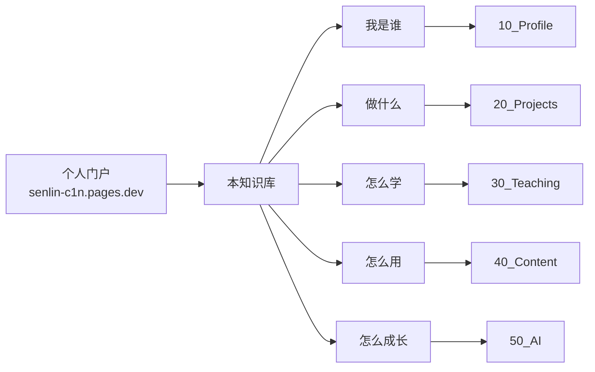

# 愈见森林的个人知识库

> 这是**森林**(赵森林)的个人操作系统,生产级别,可以直接给同行 / 徒弟 / 家长看。

## 我是谁

- [[10_Profile/我是谁]] · 我的来历、几件事、价值主张
- [[10_Profile/我在哪]] · 现在做哪些事、做到什么程度
- [[10_Profile/我要去哪]] · 一年目标 + 关键里程碑
- [[10_Profile/能力地图]] · 能交付 / 在补 / 不接

## 我做什么(项目)

- [[20_Projects/index]] · 30+ 个项目全景
- [[60_Assets/dossiers/]] · 7 个核心项目的真实档案
  - [乐其翔展览系统](file:///C:/my_know/60_Assets/dossiers/open_leqixiang.md)
  - [Python 冒险岛](file:///C:/my_know/60_Assets/dossiers/python-adventure.md)
  - [智创未来编程学院机构站](file:///C:/my_know/60_Assets/dossiers/senlin_website.md)
  - [宜昌宇宙探索互动站](file:///C:/my_know/60_Assets/dossiers/world_website.md)

## 我怎么教(教学)

- [[30_Teaching/index]] · 教学体系
- [[60_Assets/dossiers/teaching]] · 18 单元分类 + 7 天创客营档案

## 我怎么说(内容)

- [[40_Content/index]] · 抖音 + 直播 + 个人内容
- [[60_Assets/dossiers/douyin]] · 愈见森林 151 → 10000 粉
- [[60_Assets/dossiers/live-streaming]] · 直播 6 轮 SOP

## 我怎么用 AI

- [[50_AI/index]] · 工具与工作流
- [Codex 会话数据(92 个)](file:///C:/my_know/60_Assets/codex-session-digest.json) · 落档可检索

## 快速开始

- 第一次打开?看 [[00_Home/快速使用指南]]
- 想知道这个库怎么搭出来的?看 [[00_Home/我是怎么建这个库的]]

## 仓库信息

- 本地:`C:\my_know`(git 仓)
- 远程:`https://github.com/zhaosenlin12-creator/my_edu.git`
- 当前 HEAD:`37c22be`
- Obsidian 打开:开始菜单搜 Obsidian(或桌面双击 `Obsidian-MyEdu.bat`)

## 隐私 / 同步

本知识库的 `.obsidian/`、`70_Sources/vibe-hub/pages/`、本地 CSV 都不进 GitHub。详见 `.gitignore`。